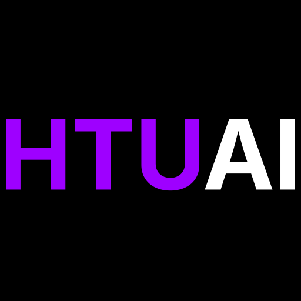

<div align="center">



# HTUAI — HTU Smart Advisor

**A full-stack academic management platform for Al Hussein Technical University students.**

[](https://nextjs.org)
[](https://react.dev)
[](https://www.typescriptlang.org)
[](https://www.prisma.io)
[](https://www.postgresql.org)
[](https://tailwindcss.com)
[](https://vercel.com)

[Features](#-features) · [Tech Stack](#-tech-stack) · [Getting Started](#-getting-started) · [Project Structure](#-project-structure) · [API Reference](#-api-reference) · [Contributing](#-contributing)

</div>

---

## 📖 Overview

**HTUAI** is a production-grade academic advising platform built exclusively for Al Hussein Technical University (HTU). It empowers students to take full control of their academic journey through two deeply integrated modules:

- **Course Tracker** — Visualize your degree progress, track prerequisite chains, manage electives, and monitor credit-hour completion across all curriculum categories.
- **Semester Planner** — Plan term-by-term, calculate GPA/CGPA using HTU's official grading scale, log study sessions, take rich-text notes, schedule exams, and sync everything to Google Calendar.

> **Live product used by real HTU students** — quality, correctness, and data integrity are non-negotiable.

---

## ✨ Features

### 🎓 Authentication & Onboarding
- **University ID login** with secure bcrypt-hashed passwords
- **Google OAuth** for frictionless sign-in
- **Account claiming** — each University ID can only be registered once
- **Major selection** from 8 supported HTU curriculum programs

### 📋 Course Tracker
- Full interactive curriculum view by major (University / College / Department requirements)
- Toggle courses as completed — progress auto-saved
- **Prerequisite engine** with AND/OR logic, credit-hour thresholds, and department-approval locks
- Elective caps enforced automatically (3 University electives max)
- Global course autocomplete search across the entire HTU catalog

### 📓 Course Notes
- **Tiptap** Notion-style rich-text editor per course
- Slash commands `/`, floating menus, bubble menus, task lists, tables, code blocks, and highlights
- Auto-save to database as you type

### 📅 Semester Planner
- Create and manage academic terms with start/end dates
- Editable course table (grade, instructor, location, weekly schedule)
- **GPA calculator** using HTU's official D/M/P/U scale
- **CGPA tracking** with previous-semester history support
- Study-session logging with per-course minute tracking
- Smart insights: neglected course alerts, upcoming exam reminders, GPA projections

### 🏆 Gamification
- XP points and level progression
- Daily study streaks
- Personal quests and achievement badges
- All strictly personal — no leaderboards or competitive features

### 🗓 Google Calendar Integration
- One-way sync: push midterm dates, final exams, and weekly class schedules to Google Calendar
- Timezone-aware (`Asia/Amman`, UTC+3) with automatic reminders

### 🛡 Admin Dashboard
- Analytics: total students, visitor counts, major distribution, device breakdown, 30-day traffic
- Per-student credit-hour data, top courses, recent activity heatmap
- Secure admin-only access via secret header

---

## 🛠 Tech Stack

| Layer | Technology |
|---|---|
| **Framework** | Next.js 16 (App Router) |
| **UI** | React 19, Tailwind CSS 4, Framer Motion |
| **Language** | TypeScript 5 |
| **Database** | PostgreSQL (Vercel Postgres / Neon) |
| **ORM** | Prisma |
| **Auth** | NextAuth.js v4 (Credentials + Google OAuth) |
| **Rich Text** | Tiptap |
| **Validation** | Zod |
| **Calendar** | Google Calendar API v3 |
| **Infrastructure** | Terraform (IaC) |
| **Deployment** | Vercel |

---

## 🚀 Getting Started

### Prerequisites

- Node.js 20+
- PostgreSQL database (or a [Neon](https://neon.tech) / [Vercel Postgres](https://vercel.com/storage/postgres) instance)
- Google OAuth credentials (for social login + Calendar sync)
- npm or pnpm

### 1. Clone the repository

```bash
git clone https://github.com/Omarmubx7/htuai.git
cd htuai/smart-advisor-ui
```

### 2. Install dependencies

```bash
npm install
```

### 3. Configure environment variables

Copy the example environment file and fill in your values:

```bash
cp .env.example .env.local
```

| Variable | Description |
|---|---|
| `POSTGRES_PRISMA_URL` | PostgreSQL connection string for Prisma |
| `POSTGRES_URL_NON_POOLING` | Direct (non-pooled) PostgreSQL URL for migrations |
| `NEXTAUTH_SECRET` | Random secret for NextAuth JWT signing |
| `NEXTAUTH_URL` | Your deployment URL (e.g., `http://localhost:3000`) |
| `GOOGLE_CLIENT_ID` | Google OAuth Client ID |
| `GOOGLE_CLIENT_SECRET` | Google OAuth Client Secret |
| `ADMIN_SECRET` | Secret header value for admin API routes |

### 4. Run database migrations

```bash
npx prisma migrate deploy
```

Or for local development with schema changes:

```bash
npx prisma migrate dev
```

### 5. Initialize the database

```bash
curl -X POST http://localhost:3000/api/setup \
  -H "x-admin-secret: YOUR_ADMIN_SECRET"
```

### 6. Start the development server

```bash
npm run dev
```

Open [http://localhost:3000](http://localhost:3000) in your browser.

---

## 📁 Project Structure

```
smart-advisor-ui/
├── app/                        # Next.js App Router
│   ├── (pages)/                # Page routes
│   ├── api/                    # API Route Handlers
│   │   ├── auth/               # NextAuth endpoints
│   │   ├── planner/            # Semester planner API
│   │   ├── progress/           # Course progress API
│   │   ├── connect/google/     # Google Calendar integration
│   │   └── admin/              # Admin analytics API
│   └── globals.css
├── components/                 # Reusable React components
│   ├── ui/                     # Atomic base UI components
│   ├── CourseTrackerView.tsx   # Degree progress view
│   ├── PlannerHomeClient.tsx   # Semester planner hub
│   ├── CourseNotesEditor.tsx   # Tiptap rich-text editor
│   └── ...
├── lib/                        # Core business logic
│   ├── grading.ts              # ← GPA/CGPA calculations (authoritative)
│   ├── safe-storage.ts         # Safe localStorage/sessionStorage wrapper
│   ├── advisor/                # Prerequisite + curriculum logic
│   └── db.ts                   # Prisma client utilities
├── prisma/
│   ├── schema.prisma           # ← Definitive data model
│   └── migrations/             # Migration history
├── public/
│   └── data/
│       ├── curriculum.json     # ← Authoritative HTU course catalog
│       ├── curriculum_rules.json
│       └── shared.json
├── scripts/                    # DB cleanup and maintenance utilities
└── terraform/                  # Infrastructure as Code
```

---

## 📐 Grading Scale

HTUAI uses HTU's official grading scale — **never deviate from this**:

| Grade | Label | GPA Points |
|---|---|---|
| D | Distinction | 4.0 |
| M | Merit | 3.2 |
| P | Pass | 2.4 |
| U | Unclassified | 0.0 |
| — | Planned / Not Graded | `null` (excluded from GPA) |

**GPA Formula:**
```
GPA = Σ(grade_points × credit_hours) / Σ(credit_hours)
```
Only courses with a completed grade (D, M, P, U) are included.
All GPA logic lives in [`lib/grading.ts`](smart-advisor-ui/lib/grading.ts).

---

## 🔌 API Reference

| Method | Endpoint | Auth | Description |
|---|---|---|---|
| `GET` | `/api/courses` | — | List all courses (autocomplete) |
| `GET` | `/api/profile/[id]` | Session | Get student profile & major |
| `POST` | `/api/profile/[id]/save` | Session | Save student's major |
| `GET` | `/api/progress/[id]` | Session | Get completed courses |
| `POST` | `/api/progress/[id]/save` | Session | Save completed courses |
| `GET` | `/api/planner/summary` | Session | Unified planner overview |
| `GET` | `/api/planner/semesters` | Session | List all semesters |
| `POST` | `/api/planner/semesters` | Session | Create a new semester |
| `PUT` | `/api/planner/semesters/[id]` | Session | Update semester metadata |
| `POST` | `/api/planner/courses` | Session | Add a course to a semester |
| `PUT` | `/api/planner/courses/[id]` | Session | Update course details |
| `POST` | `/api/planner/study-sessions` | Session | Log a study session |
| `POST` | `/api/connect/google/sync` | Session + OAuth | Push to Google Calendar |
| `GET` | `/api/connect/google/callback` | OAuth flow | Google OAuth callback |
| `GET` | `/api/admin/stats` | `x-admin-secret` | Analytics dashboard data |
| `GET` | `/api/admin/logs` | `x-admin-secret` | Recent activity logs |
| `POST` | `/api/setup` | `x-admin-secret` | Initialize DB tables |
| `POST` | `/api/reset` | `x-admin-secret` | ⚠ Full DB reset (destructive) |

---

## 🗃 Data Model

```
users ──────────────── student_profile
  │                    student_progress
  ├── semesters ──────── courses ─── course_notes
  │       │                │         study_sessions
  │       │                └── calendar_events
  │       └── semester_notes
  │
  ├── integration_tokens  (Google OAuth tokens)
  ├── gamification_profile
  ├── quests
  ├── user_badges
  ├── gpa_history
  └── visitor_logs
```

---

## 🔒 Security

- Every API route authenticates the session via `getServerSession()` before processing
- All user inputs validated with **Zod** schemas
- Passwords hashed with **bcrypt** (cost factor 10)
- Secrets stored in environment variables — never hardcoded
- Admin routes protected by `x-admin-secret` header
- No raw SQL — all queries go through Prisma ORM

---

## ⚠️ Key Rules & Gotchas

| Area | Rule |
|---|---|
| **GPA** | Only D/M/P/U grades count. Null grades are always excluded. |
| **localStorage** | Always use `lib/safe-storage.ts` — never access `localStorage` directly |
| **Timezone** | All date/time operations must use `Asia/Amman` (UTC+3) |
| **Course Codes** | Only use real HTU course codes from `public/data/curriculum.json` |
| **Semester Status** | A semester is `COMPLETED` only if its `end_date` has passed |
| **Auth** | Every protected API route must call `getServerSession()` |
| **DB Writes** | Multi-table writes must use Prisma `$transaction` |

---

## 🤝 Contributing

1. Fork the repository and create a feature branch from `main`
2. Follow the conventions in [`GEMINI.md`](GEMINI.md) — the authoritative engineering guide
3. Keep changes minimal and focused; match existing naming and code style
4. Run lint before submitting: `cd smart-advisor-ui && npm run lint`
5. Open a pull request with a clear description of what changed and why

> **Do not** invent course codes, business rules, or GPA formulas not defined in the spec. When in doubt, open an issue to discuss first.

---

## 📜 License

This project is proprietary software built for Al Hussein Technical University.
All rights reserved © HTU Smart Advisor.

---

<div align="center">

Built with ❤️ for HTU students

</div>
